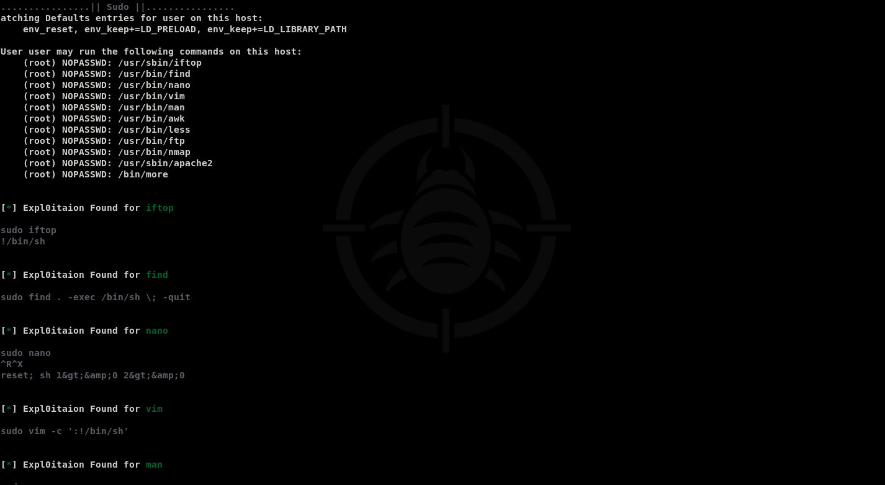
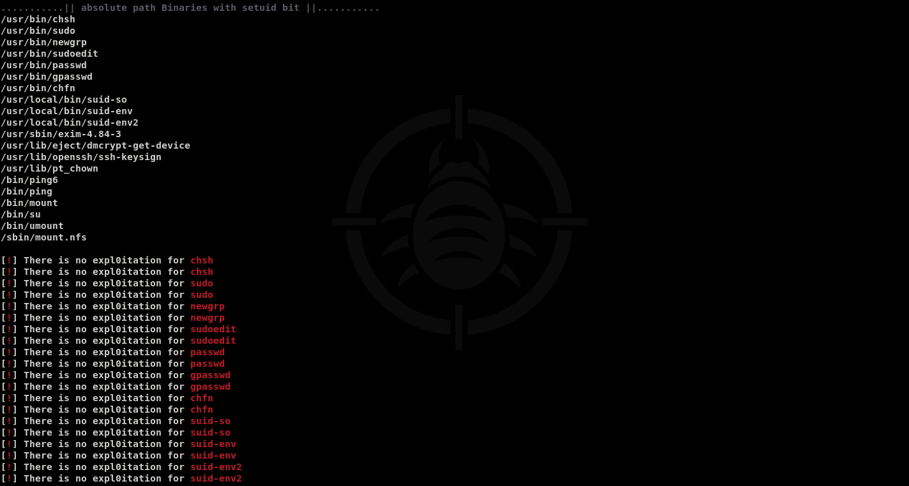
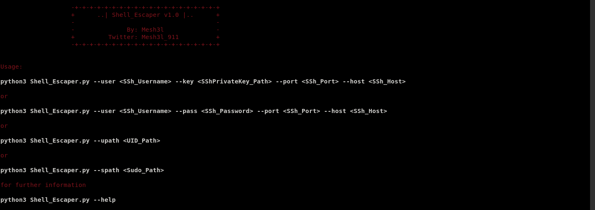

# Shell_Escaper v1.0 :

 <b>A tool that automates the process of extracting the Shell Escape Sequences for Binaries with Setuid bit and Sudo out of GTFOBins with three differint ways both locally and remotely </b>
 
 
   
 
   
 
   
 

# Installation : 
 <code>git clone https://github.com/Mesh3l911/Shell_Escaper.git</code>
 

# Requirements :
 
<code>pip install -r requirements.txt</code>
 

# Usage :
 
 
    
 

 
<code>python3 Shell_Escaper.py --user <SSh_Username> --key <SShPrivateKey_Path> --port <SSh_Port> --host <SSh_Host></code>
 

or
 

<code>python3 Shell_Escaper.py --user <SSh_Username> --pass <SSh_Password> --port <SSh_Port> --host <SSh_Host></code> (Not Recommended for real life engagements)
 

or
 

<code>python3 Shell_Escaper.py --upath <UID_Path></code>
 

or
 

<code>python3 Shell_Escaper.py --spath <Sudo_Path></code>

 

 # POC :
 <code>https://youtu.be/kOvfIEVrekE</code>
  
# P.s :
<b>It doesn't have any auto-expl0it<b> 

# Happy Hunting ^_^ 
